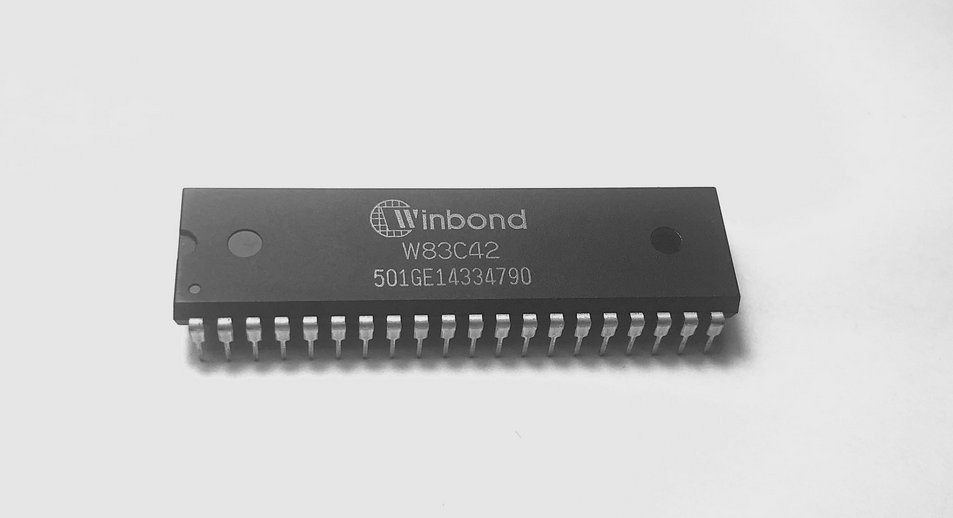
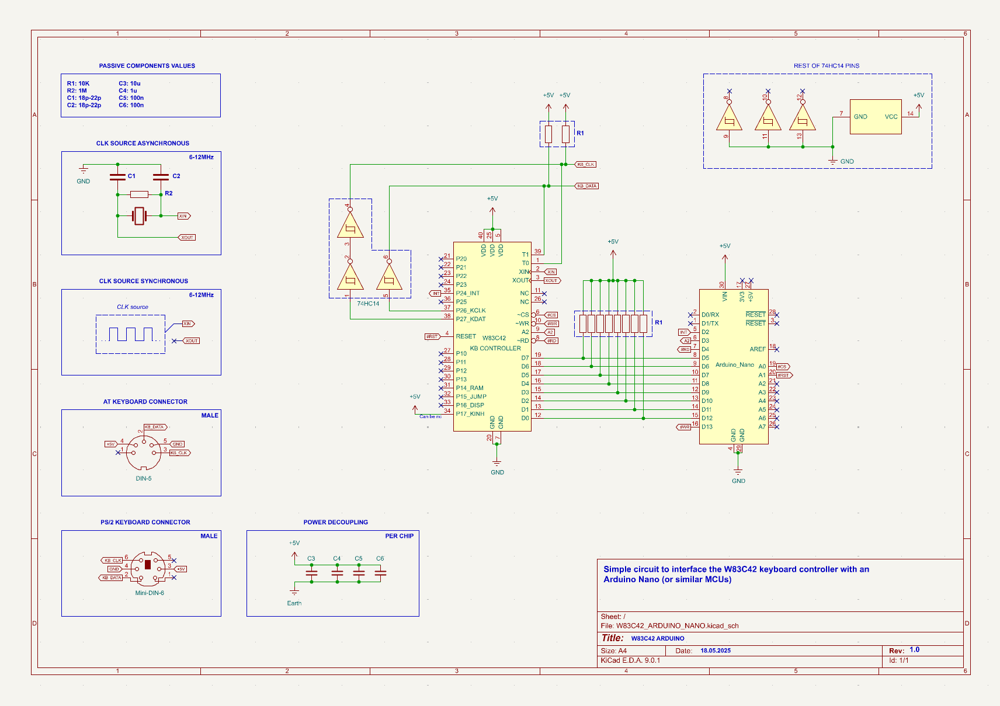

# W83C42 driver for arduino
This is a simple arduino driver for the Winbond W83C42 keyboard controller for PS2/AT keyboards. 
## Introduction
The W83C42 is a keyboard controller designed for Intels 386 DX/SX and 486 DX/SX CPUs, but also compatible with older ones. The controller receives serial data from the keyboard, and has an option to interrupt the CPU when the keyboard data is ready to be read from the output buffer. The chips can "translate" received snacodes from AT (SC Set 2) to XT (SC Set 1). The chips is **hardwired** to work as a keyboard controller, instead of using a software implementation - thats how the original Intel 8042 worked - which makes it considerable faster, *in theory*.
The chip needs an external clock source to work, the source can be either synchronous or asynchronous to the CPU clock, either way, the clock needs to be between 6 and 12MHz.

### To use it:
- Download the source files.
- Create a new folder called "W83C42" in your local folder with arduino libraries.
- Add the source files to the folder.
- If youre not familiar with the W83C42, i added a KiCad schematic schowing the basic setup of how to connect it up to an Arduino Nano (or any arduino), if you dont have Kicad i also added a PNG file. You can also check out the [schematic](https://theretroweb.com/chip/documentation/w83c42-6754b67123cf0399527016.pdf).
- After you have connected everything you can run a simple example i included in the "Code" folder.
- Enjoy :DDDD !

## Some important details
- I personally tested the code, and the schematic with an Arduino Nano and an Acer 6511 TW (PS2, AT/XT keyboard)
- This chips is very finicky, i have worked very hard to get it working and even after all this time now and again it acts weirdly after i change something.
- The inverter setup shown on the schematic is not neccesary if youre not going to be sending commands *directly to the keyboard*, if that is the case, leave the KB_CLK_OUT and KB_DATA_OUT pins not connected.
- Both the code and the schematic *should* be compatible with other keyboard controllers of this type ie. 8042, 80C42, 82C42. Unfortunately i couldnt get it to work with either 80C42 (unmarked, but taken out of a 80286 MOBO) or the Mitsubishi M5L8042. I never found out the reason they didnt work, they migh have been damaged before i got them.
- The code works, but is not finished, i will try to update it in upcoming days/weeks.
## A picture of the W83C42 chip in the DIP40 package:

## A picture of the schematic diagram:

